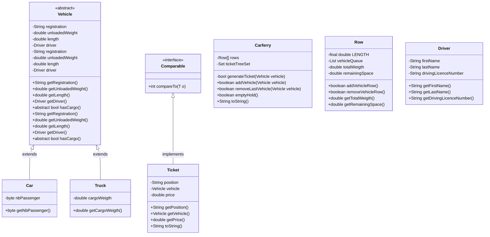

```mermaid
classDiagram
	Vehicle <|-- Car : extends
	Vehicle <|-- Truck : extends

	Comparable <|-- Ticket : implements
			
	class Comparable {
		<<interface>>
		+int compareTo(T o)
	}
      
	class Vehicle {
		<<abstract>>
		-String registration
		-double unloadedWeight
		-double length
		-Driver driver
		+String getRegistration()
		+double getUnloadedWeight()
		+double getLength()
		+Driver getDriver()
		+abstract bool hasCargo()
	}
			
	class Car {
		-byte nbPassenger
		+byte getNbPassenger()
	}
			
	class Truck {
		-double cargoWeigth
		+double getCargoWeigth()
	}
			
	class Carferry {
		-Row[] rows
		-Set<Ticket> ticketTreeSet
		-bool generateTicket(Vehicle vehicle)
		+boolean addVehicle(Vehicle vehicle)
		+boolean removeLastVehicle(Vehicle vehicle)
		+boolean emptyHold()
		+String toString()
	}
			
	class Row {
		-final double LENGTH
		-List<Vehicle> vehicleQueue
		-double totalWeigth
		-double remainingSpace
		+boolean addVehicleRow()
		+boolean removeVehicleRow()
		+double getTotalWeigth()
		+double getRemainingSpace()
	}
			
	class Driver {
		-String firstName
		-String lastName
		-String drivingLicenceNumber
		+String getFirstName()
		+String getLastName()
		+String getDrivingLicenceNumber()
	}
			
	class Ticket {
		-String position
		-Vehicle vehicle
		-double price
		+String getPosition()
		+Vehicle getVehicle()
		+double getPrice()
		+String toString()
	}

	class Vehicle {
		<<abstract>>
		-String registration
		-double unloadedWeight
		-double length
		-Driver driver
		+String getRegistration()
		+double getUnloadedWeight()
		+double getLength()
		+Driver getDriver()
		+abstract bool hasCargo()
	}
```
